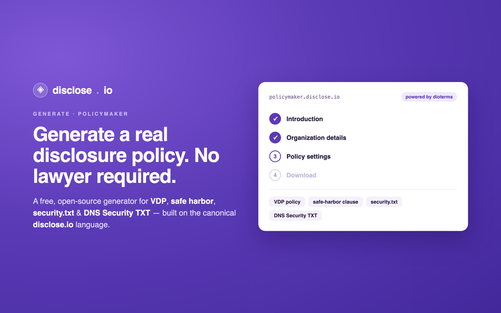

<div align="center">



# policymaker

### Generate a real vulnerability-disclosure policy — VDP, safe harbor, security.txt & DNS Security TXT — in minutes. No lawyer required.

<p>
<a href="https://github.com/disclose/policymaker/actions/workflows/deploy.yml"></a>
<a href="https://policymaker.disclose.io"></a>
<a href="https://github.com/disclose/dioterms"></a>
<a href="LICENSE"></a>

<a href="https://github.com/disclose/policymaker/issues"></a>
</p>

*Part of [the disclose.io Project](https://disclose.io) · [dioterms](https://github.com/disclose/dioterms) · [directory](https://directory.disclose.io) · [state](https://state.disclose.io) · [dioseal](https://github.com/disclose/dioseal)*

</div>

---

**[policymaker.disclose.io](https://policymaker.disclose.io)** is a free, open-source generator that turns a few plain questions about your organization into a complete, defensible security-disclosure setup:

- a full **Vulnerability Disclosure Policy** (VDP), with or without a coordinated-disclosure window,
- a standalone **safe-harbor clause** to attach to an existing policy,
- a **`security.txt`** file ([RFC 9116](https://www.rfc-editor.org/rfc/rfc9116)), and
- a **DNS Security TXT** record.

Answer a short wizard, tune the settings, and download — no account, no lawyer, no starting from a blank page. Everything it produces is [CC0 1.0](./LICENSE): public domain.

## Powered by the canonical disclose.io language

policymaker doesn't invent policy text — it **ingests the canonical language from [dioterms](https://github.com/disclose/dioterms)**, the disclose.io Framework's single source of truth for disclosure terms. dioterms is vendored as a pinned submodule (`vendor/dioterms`) and synced into the app at build (`scripts/sync-templates.mjs`), so every policy policymaker generates descends from the same lawyer-reviewed source — and the language changes only through reviewed, public pull requests upstream. Canonical and deployed never drift.

> To adopt newer language: bump the `vendor/dioterms` submodule pin and re-run the sync. Never hand-edit `static/templates/disclose-io-*` — dioterms is authoritative.

## Getting started

policymaker is a [Nuxt.js](https://nuxtjs.org/) frontend application.

```bash
# 1. clone (with the dioterms submodule)
git clone --recurse-submodules https://github.com/disclose/policymaker.git
cd policymaker

# 2. install dependencies
npm install --legacy-peer-deps

# 3. sync the canonical templates from dioterms
node scripts/sync-templates.mjs

# 4. start the local dev server
npx nuxt dev
```

Then open [http://localhost:3000](http://localhost:3000) and start building.

> Already cloned without submodules? Run `git submodule update --init` first.

## Contributing

- **Policy / term wording** is **not** edited here — it lives in [dioterms](https://github.com/disclose/dioterms). Open a Discussion/PR there; policymaker picks it up on its next submodule bump.
- **The app itself** (UI, flows, generators) — fork → change → PR. Please run `npm run lint` first.
- **Translations** — add the locale to dioterms (`terms/languages.json` + the term files); policymaker serves whatever dioterms provides.

## Suggestions & feedback

Have an idea for the app? [Raise an issue](https://github.com/disclose/policymaker/issues). Not comfortable with GitHub? Comment on the [disclose.io Community Forum](https://community.disclose.io/t/policymaker-vdp-policy-generator-plus-security-txt-and-dns-security-txt-beta-is-live/255).
