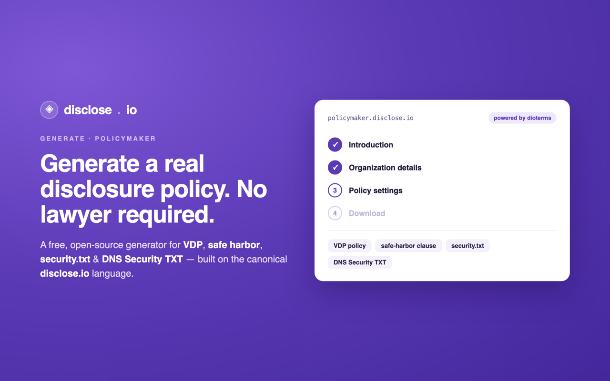

<div align="center">



# policymaker

### Generate a vulnerability-disclosure policy, safe harbor, security.txt, and DNS Security TXT in minutes.

<p>
<a href="https://github.com/disclose/policymaker/actions/workflows/deploy.yml"></a>
<a href="https://policymaker.disclose.io"></a>
<a href="https://github.com/disclose/dioterms"></a>
<a href="LICENSE.md"></a>
</p>

*Part of [the disclose.io Project](https://disclose.io), open and vendor-neutral infrastructure for vulnerability disclosure.*

</div>

---

[policymaker.disclose.io](https://policymaker.disclose.io) is a free, account-free generator that turns a four-step wizard into a deployable disclosure package:

- a full Vulnerability Disclosure Policy (VDP), with or without a coordinated-disclosure window;
- a standalone safe-harbor clause;
- a [`security.txt`](https://www.rfc-editor.org/rfc/rfc9116) file;
- DNS Security TXT records; and
- a ZIP containing the policies, discovery artifacts, and deployment instructions.

Everything runs in the browser. Answers stay in the current tab, are not sent to a policymaker backend, and reset when the page reloads. Generated policy material is available under [CC0 1.0](LICENSE.md).

## Canonical policy source

Policy wording comes only from [disclose/dioterms](https://github.com/disclose/dioterms), pinned as the Git submodule at [`vendor/dioterms`](vendor/dioterms). Before development, tests, or production builds, policymaker generates a typed module from that exact revision. The generated file is intentionally untracked and verified against the submodule.

The application separately checks whether each locale and policy-family combination is semantically usable. A source locale appears for a policy only when its required placeholders are present and its body is distinct from other families. This keeps incomplete upstream variants out of generated downloads without rewriting canonical wording locally.

Never edit policy wording or `src/generated/policies.ts` here. Submit wording and translation changes to DIOTerms, then update the pinned revision through the documented maintenance command.

## Development

Requirements:

- [Bun](https://bun.sh/) 1.3.6 or newer;
- Git with submodule support.

```bash
git clone --recurse-submodules https://github.com/disclose/policymaker.git
cd policymaker
bun install --frozen-lockfile
bun run dev
```

Open [http://localhost:5173](http://localhost:5173). If the repository was cloned without submodules, run `git submodule update --init --recursive` first.

### Commands

| Command | Purpose |
|---|---|
| `bun run dev` | Generate the pinned policy module and start Vite |
| `bun run test` | Run unit, component, router, and property tests |
| `bun run build` | Type-check and create the static production site |
| `bun run preview` | Preview an existing production build locally |
| `bun run verify` | Run the complete test, build, static-route, architecture, and source-fidelity suite |
| `bun run policies:check` | Confirm generated policy data byte-matches the pinned DIOTerms revision |
| `bun run policies:update` | Fetch DIOTerms `main`, update the submodule checkout, and run full verification |

Run `bun run verify` before every pull request or release.

## Repository map

| Path | Responsibility |
|---|---|
| `vendor/dioterms/` | Pinned canonical policy source |
| `scripts/` | Policy generation, architecture gates, route generation, and release verification |
| `src/domain/` | Pure validation and artifact-generation logic |
| `src/state/` | In-memory wizard state and completion rules |
| `src/components/` | Reusable presentation and form controls |
| `src/views/` | Route-level wizard and download screens |
| `src/content/` | Product guidance, never canonical policy wording |
| `tests/` | Unit, component, property, routing, and workflow coverage |
| `public/` | Static metadata, discovery files, images, and custom-domain configuration |

## Documentation

- [Architecture](docs/ARCHITECTURE.md) — policy lineage, data flow, modules, routes, and invariants.
- [Contributing](CONTRIBUTING.md) — development conventions, policy updates, and review checklist.
- [Deployment](docs/DEPLOYMENT.md) — GitHub Pages release, verification, and rollback procedures.

## Contributing and support

Application changes belong in this repository; policy wording and translations belong in [DIOTerms](https://github.com/disclose/dioterms). See [CONTRIBUTING.md](CONTRIBUTING.md) before opening a pull request.

For product ideas or defects, [open an issue](https://github.com/disclose/policymaker/issues). Community discussion is also available in the [disclose.io forum](https://community.disclose.io/t/policymaker-vdp-policy-generator-plus-security-txt-and-dns-security-txt-beta-is-live/255).
